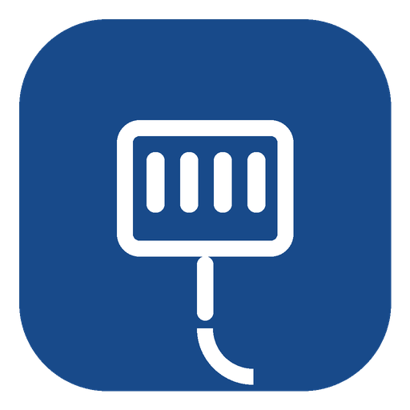

<p align="center">
  
</p>

<h1 align="center">Victron VE.Direct for Home Assistant</h1>

<p align="center">
See your Victron solar charger, battery monitor or inverter live in Home Assistant —
locally, over the VE.Direct cable, with no cloud and no polling.
</p>

---

Plug a [VE.Direct USB cable](https://www.victronenergy.com/accessories/ve-direct-to-usb-interface)
into your Home Assistant machine and this integration turns the device's
once-per-second broadcast into entities: battery voltage and current, solar
yield, state of charge, charger state, alarms and more.

Any device that speaks the VE.Direct TEXT protocol works — this integration
implements [VE.Direct protocol 3.34](https://www.victronenergy.com/upload/documents/VE.Direct-Protocol-3.34.pdf).
Entities are created from what your device actually broadcasts, so new
fields from firmware updates appear automatically.

## Installation

**With HACS (recommended):**

1. In HACS, open the ⋮ menu → **Custom repositories** and add
   `https://github.com/niecore/ha-vedirect` as type *Integration*.
2. Search for **Victron VE.Direct**, install it, and restart Home Assistant.

**Manual:** copy the `custom_components/vedirect` folder into your Home
Assistant `config/custom_components/` folder and restart.

## Setup

If you use the official Victron USB cable, Home Assistant will usually
**discover it automatically** — just confirm the notification.

Otherwise: **Settings → Devices & Services → Add Integration → Victron
VE.Direct**, then pick your serial port from the list. Done — your device
shows up with its model name, serial number and firmware version.

### More than one device?

Just repeat *Add Integration* for each cable. Every cable gets its own
device with its own entities. Tip: pick the `/dev/serial/by-id/…` entries
from the port list (the ones with `VictronEnergy` in the name) — unlike
`/dev/ttyUSB0`, they never swap around after a reboot.

## Using it

- **Energy dashboard:** add *Yield today* (MPPT) or *Charged/Discharged
  energy* (BMV/SmartShunt) as solar production / battery sensors.
- **Update speed:** the device broadcasts every second; by default Home
  Assistant records a new state every 5 seconds. Change this per device
  under the integration's **Configure** button (1–60 s).
- **Extra history sensors** (deepest discharge, charge cycles, min/max
  voltages, …) exist but are disabled by default — enable them on the
  device page if you want them.

## Troubleshooting

- **Nothing found during setup** — make sure no other software
  (VictronConnect, Venus OS, ser2net) has the port open, and that your
  cable is a genuine data cable.
- **Entities show "unavailable"** — the cable was unplugged or the device
  powered off; the integration reconnects automatically as soon as data
  returns.
- **Still stuck?** Download diagnostics from the device page (it contains
  the decoded data and frame counters) and
  [open an issue](https://github.com/niecore/ha-vedirect/issues).

## For developers

The protocol implementation (VE.Direct TEXT protocol 3.34: byte-level
parser with checksum verification, HEX-frame demux, field registry) lives
in `custom_components/vedirect/vedirect_x/` as a standalone,
Home-Assistant-free library. Run its test suite with:

```bash
pip install pytest serialx
pytest tests
```

Read-only by design: nothing is ever written to the device.
